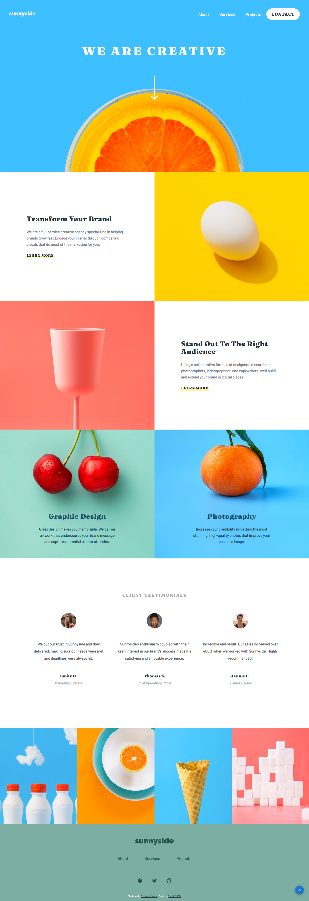

# Frontend Mentor - Sunnyside agency landing page solution

This is a solution to the [Sunnyside agency landing page challenge on Frontend Mentor](https://www.frontendmentor.io/challenges/sunnyside-agency-landing-page-7yVs3B6ef). Frontend Mentor challenges help you improve your coding skills by building realistic projects.

## Table of contents

- [Overview](#overview)
  - [The challenge](#the-challenge)
  - [Screenshot](#screenshot)
  - [Links](#links)
- [My process](#my-process)
  - [Built with](#built-with)
  - [What I learned](#what-i-learned)
- [Author](#author)

## Overview

### The challenge

Users should be able to:

- View the optimal layout for the site depending on their device's screen size
- See hover states for all interactive elements on the page

### Screenshot



### Links

- Solution URL: [Add solution URL here](https://github.com/rabahmilano/sunnyside-agency-landing-page-main)
- Live Site URL: [Add live site URL here](https://your-live-site-url.com)

## My process

### Built with

- Mobile-first workflow
- [React](https://reactjs.org/) - JS library
- [Material UI](https://mui.com/) - A library of components
- [SCSS](https://sass-lang.com/) - CSS Preprocessing
- [AOS JS](https://github.com/michalsnik/aos) - Animate On Scroll Library

### What I learned

I learnt how to modify the style of a Material UI component using `makeStyles()`

```js
const useStyles = makeStyles({
  root: {
    display: "block",
    width: "100%",
    height: "100%",
  },
});

const customStyles = useStyles();
```

## Author

- Github - [Rabha ABED](https://github.com/rabahmilano)
- Frontend Mentor - [@rabahmilano](https://www.frontendmentor.io/profile/rabahmilano)
- Codepen - [@rabahmilano](https://codepen.io/rabahmilano)
